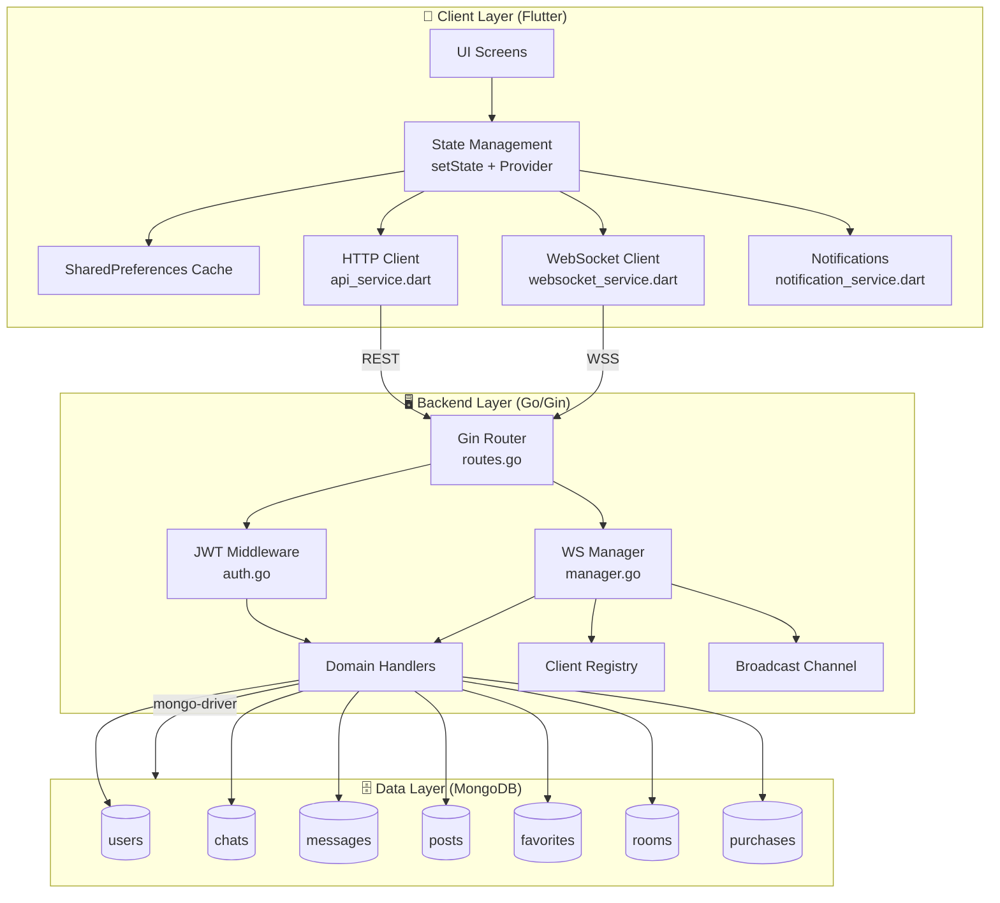
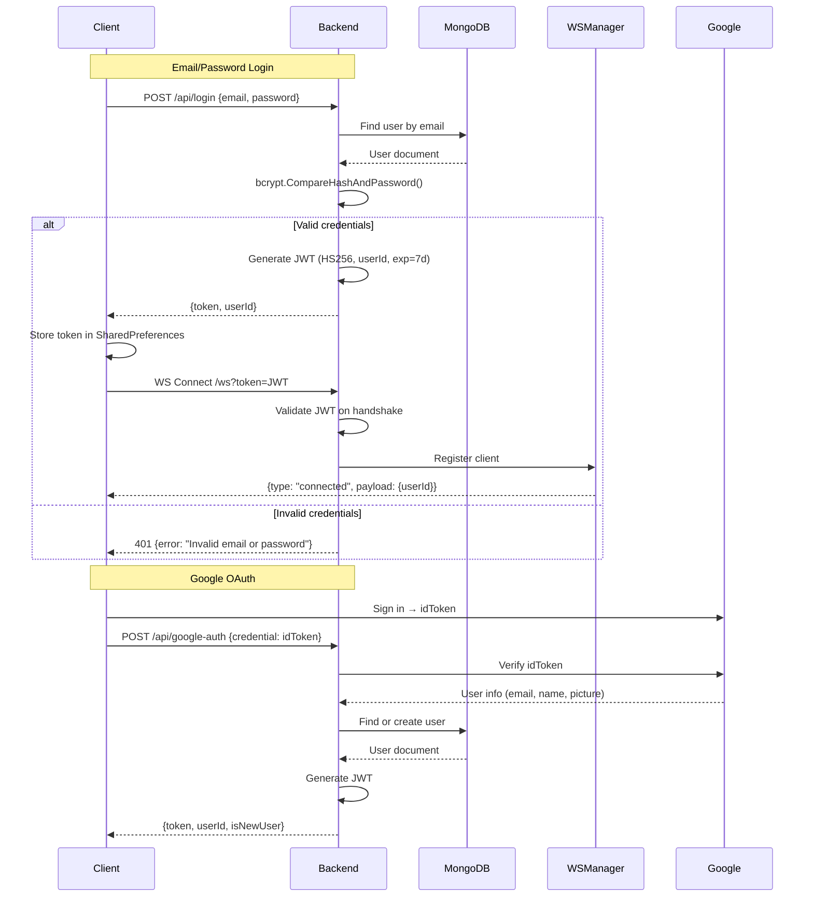
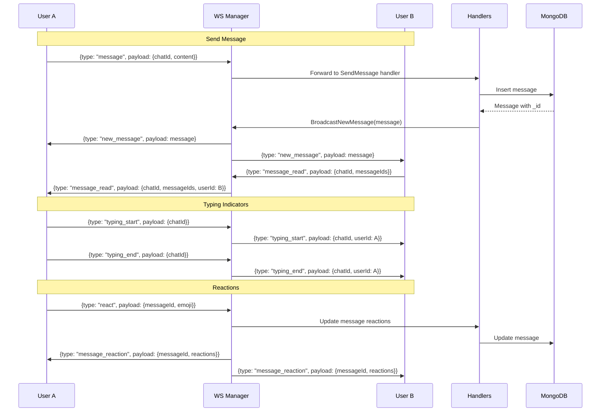
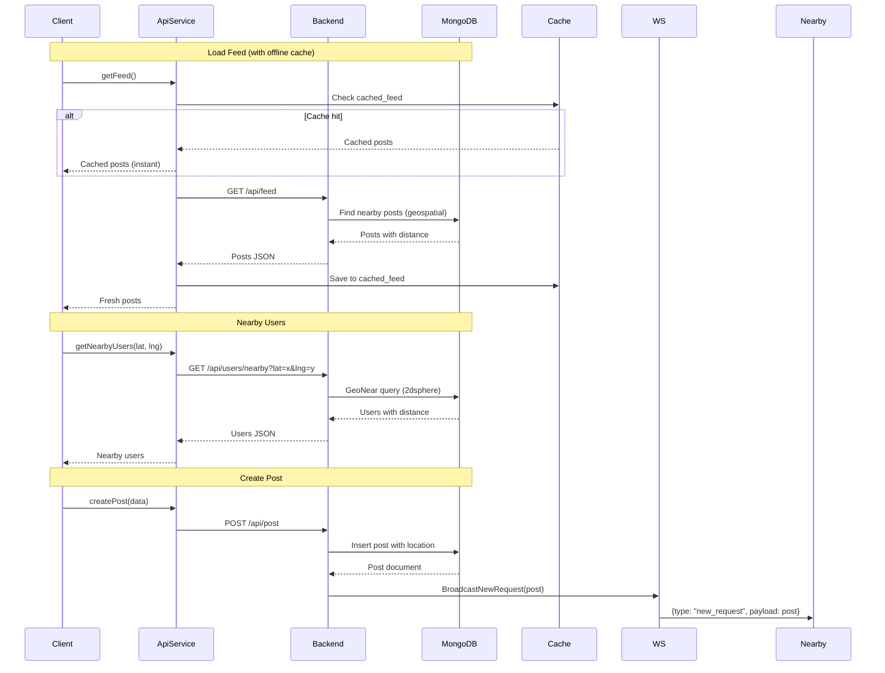
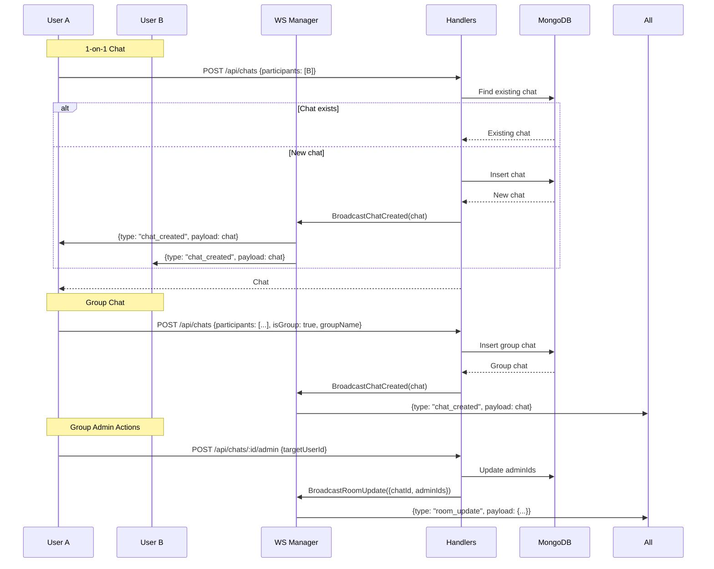
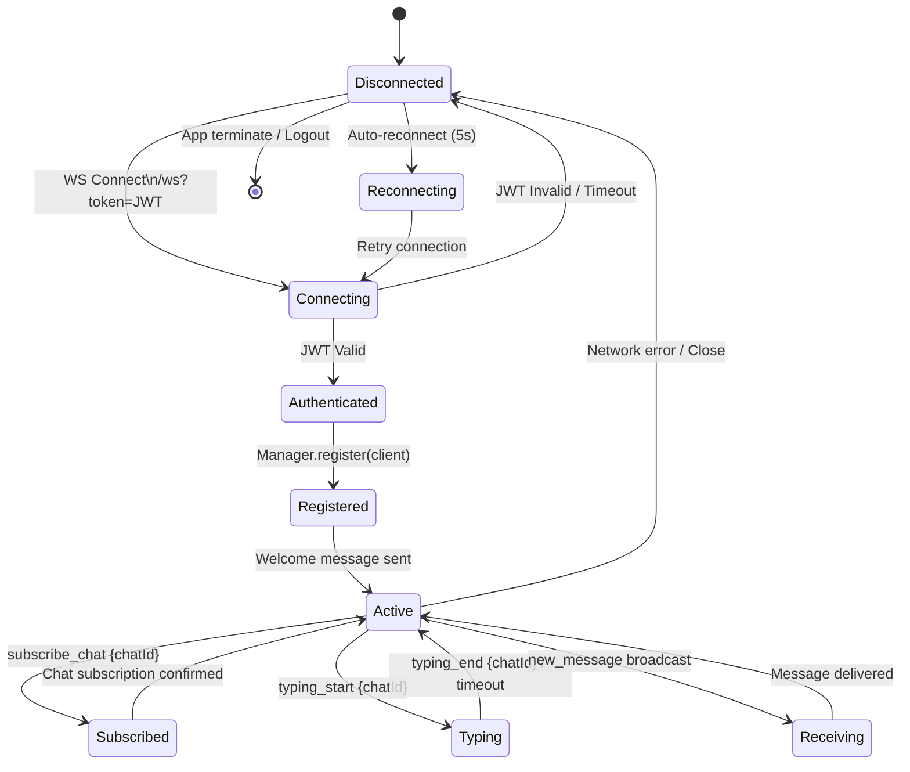
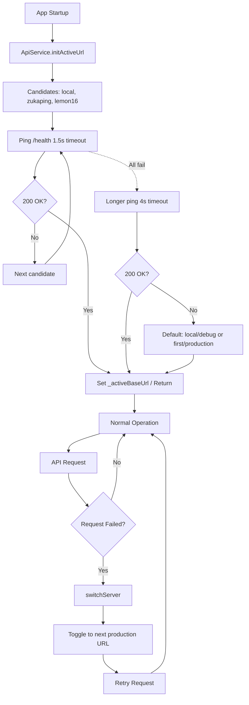
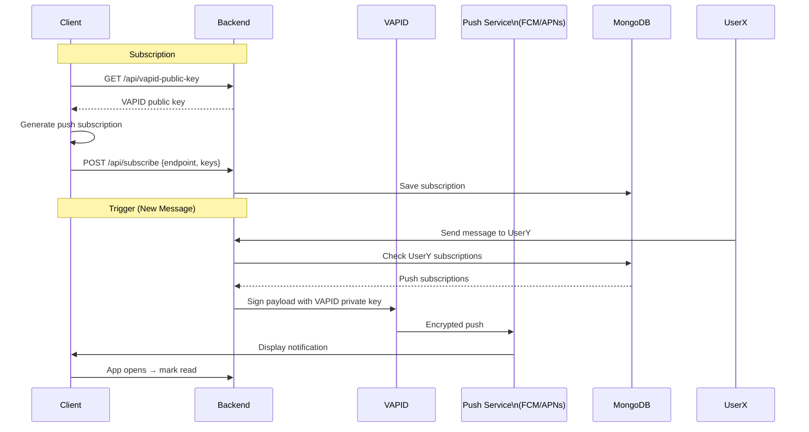
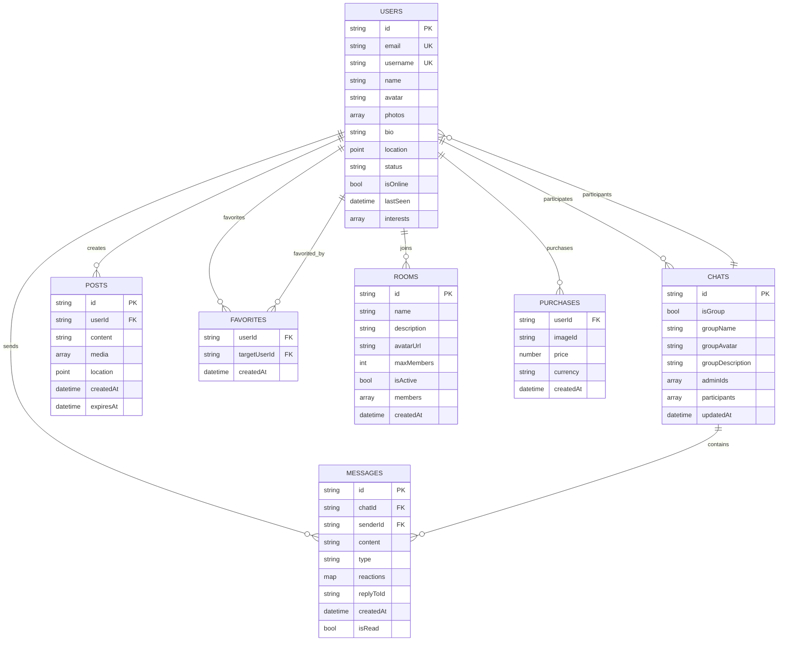
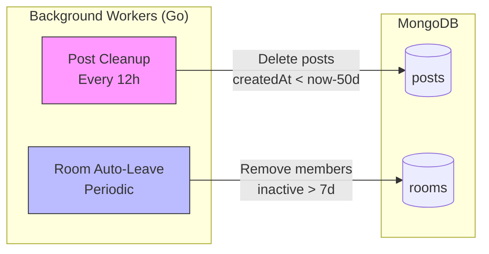

# Zukaping

A modern, real-time social discovery and chat application built with Flutter and Go.

[](https://flutter.dev/)
[](https://go.dev/)
[](https://www.mongodb.com/)
[](https://gin-gonic.com/)
[](LICENSE)

---

## Overview

Zukaping connects people through location-based discovery and real-time messaging. Built as a full-stack application with a Flutter frontend (Android, iOS, Web) and a Go/Gin backend with WebSocket support for instant messaging.

**Key capabilities:**
- Real-time 1-on-1 and group chat
- Location-based user discovery
- JWT authentication with Google OAuth
- Push notifications (VAPID)
- Exclusive content with pay-to-unlock
- Offline-first caching

---

## Tech Stack

| Layer | Technology |
|-------|------------|
| **Frontend** | Flutter 3.x (Dart) |
| **State** | `setState` + `Provider` |
| **Storage** | `SharedPreferences` |
| **Networking** | `http` + `web_socket_channel` |
| **Backend** | Go 1.21+ / Gin |
| **Database** | MongoDB (mongo-driver) |
| **Real-time** | `gorilla/websocket` |
| **Auth** | `golang-jwt` (HS256), `bcrypt` |
| **Push** | `webpush-go` (VAPID) |

---

## Architecture

```
┌─────────────┐     HTTPS/WSS      ┌─────────────┐     MongoDB      ┌─────────────┐
│   Client    │ ◄────────────────► │   Backend   │ ◄──────────────► │  Database   │
│  (Flutter)  │   REST + WebSocket │   (Go/Gin)  │   mongo-driver   │  (MongoDB)  │
└─────────────┘                    └─────────────┘                  └─────────────┘
```

### Client Layer (Flutter)
- **State:** Local `setState` + `Provider` for theme/notifications
- **Persistence:** `SharedPreferences` for tokens, cached feeds/chats/messages
- **Networking:** `http` for REST, `web_socket_channel` for real-time
- **Offline-first:** Instant cached loads with background sync

### API Layer (Go/Gin)
- **REST endpoints** organized by domain (auth, users, posts, chats, favorites, rooms, content)
- **JWT middleware** (HS256) extracts `userId` into request context
- **CORS** configured for localhost, Render, and custom origins
- **Multipart** file upload for images

### Real-Time Layer (WebSocket Hub)
Central `Manager` with per-client goroutines:
- **Registry:** `map[*Client]bool` with `userID` tracking
- **Broadcast:** Fan-out to all connected clients
- **Message types:** `new_message`, `new_request`, `typing_start/end`, `message_read`, `message_reaction`, `user_status_update`, `room_update`, `subscribe_chat`, `ping/pong`

### Data Layer (MongoDB)
| Collection | Key Indexes |
|------------|-------------|
| `users` | `email` (unique), `location` (2dsphere), `status+updatedAt` |
| `chats` | `participants`, `isGroup+updatedAt` |
| `messages` | `chatId+createdAt`, `senderId+createdAt` |
| `posts` | `createdAt`, `location` (2dsphere), `expiresAt` (TTL) |
| `favorites` | `userId+targetUserId` (unique) |
| `rooms` | `isActive+createdAt`, `members.userId` |
| `purchases` | `userId+imageId` (unique) |

**Background workers:** Post cleanup (50-day TTL, every 12h), Room auto-leave (7-day inactivity).

---

## Project Structure

```
lemon16/
├── backend/
│   ├── main.go                    # Entry point, DB, WS hub, HTTP server
│   ├── database/database.go       # MongoDB connection
│   ├── handlers/                  # HTTP handlers by domain
│   │   ├── auth.go, user.go, post.go, chat.go, message.go
│   │   ├── favorite.go, room.go, content.go, google_auth.go, push.go
│   ├── middleware/
│   │   ├── auth.go, ratelimit.go
│   ├── models/                    # Go structs (User, Chat, Message, Post, Room...)
│   ├── routes/routes.go           # Gin router, CORS, endpoint map
│   └── websocket/manager.go       # WS hub, client registry, broadcast
│
├── mobile_app/
│   ├── lib/
│   │   ├── main.dart              # App entry, theme, routing
│   │   ├── models/                # Dart models
│   │   ├── screens/               # UI screens (feed, chat, profile, auth...)
│   │   ├── services/
│   │   │   ├── api_service.dart       # REST client, failover
│   │   │   ├── websocket_service.dart # WS connection, reconnection
│   │   │   ├── notification_service.dart
│   │   │   ├── theme_service.dart
│   │   │   └── sound_service.dart
│   │   ├── widgets/               # Reusable components
│   │   └── utils/helpers.dart     # JWT decode, base64url utils
│   └── pubspec.yaml
```

---

## Getting Started

### Prerequisites
- Flutter SDK 3.0+
- Go 1.19+
- MongoDB (local or Atlas)

### Backend

```bash
cd backend
go mod download
cp .env.example .env   # Add MONGODB_URI, JWT_SECRET
go run main.go
# Runs on http://localhost:8080
```

### Frontend

```bash
cd mobile_app
flutter pub get
flutter run -d chrome   # or -d android / -d ios
```

---

## Environment Variables

### Backend (`.env`)
```env
PORT=8080
GIN_MODE=release
MONGODB_URI=mongodb+srv://...
JWT_SECRET=your-secure-random-string
ALLOWED_ORIGINS=https://your-frontend.com
VAPID_PRIVATE_KEY=...
VAPID_PUBLIC_KEY=...
```

### Frontend
Configure `API_URL` at build time:
```bash
flutter build web --dart-define=API_URL=https://your-backend.com/api
```

---

## Authentication Flow

```
Client                    Backend
  │                          │
  ├─ POST /api/login ──────► │
  │                          ├─ Validate credentials
  │                          ├─ Create JWT (HS256, 7d expiry)
  │ ◄─ { token, userId }────┤
  │                          │
  ├─ WS /ws?token=... ─────► │
  │                          ├─ Validate JWT on handshake
  │                          └─ Register client in WS Manager
```

---

## Server Failover (Client-Side)

`ApiService.initActiveUrl()` runs at startup:
1. Candidates: `[local, zukaping.onrender.com, lemon16.onrender.com]`
2. Ping `/health` with 1.5s timeout
3. First 200 OK → active server
4. Fallback: retry production with 4s timeout
5. `switchServer()` toggles to next production URL on failure

---

## Push Notifications

- VAPID keys generated at startup
- Public key via `GET /api/vapid-public-key`
- Client subscribes via `POST /api/subscribe`
- Server sends via `webpush-go` on: new message, new request, mention, group invite

---

## Deployment

### Backend (Render/Heroku/Fly.io)
```bash
go build -o server main.go
# Set env vars, run ./server
```

### Frontend Web (Vercel/Firebase/Netlify)
```bash
flutter build web --release --dart-define=API_URL=https://api.yourapp.com/api
# Deploy build/web/
```

### Android
```bash
flutter build apk --release
# Upload build/app/outputs/flutter-apk/app-release.apk
```

### iOS
```bash
flutter build ios --release
# Open Runner.xcworkspace in Xcode, archive & upload
```

---

## API Reference

### Public
| Method | Endpoint | Description |
|--------|----------|-------------|
| `POST` | `/api/signup` | Register |
| `POST` | `/api/login` | Login |
| `POST` | `/api/google-auth` | Google OAuth |
| `GET` | `/api/vapid-public-key` | Push public key |
| `GET` | `/api/health` | Health check |

### Protected (Bearer token required)
| Method | Endpoint | Description |
|--------|----------|-------------|
| `GET` | `/api/me` | Current user profile |
| `PUT` | `/api/me` | Update profile |
| `GET` | `/api/feed` | Nearby posts |
| `POST` | `/api/post` | Create post |
| `GET` | `/api/chats` | User's chats |
| `POST` | `/api/chats` | Create chat |
| `GET` | `/api/messages/:id` | Chat messages |
| `POST` | `/api/message` | Send message |
| `GET` | `/api/users/nearby` | Nearby users |
| `POST` | `/api/favorite` | Toggle favorite |
| `GET` | `/api/rooms` | List rooms |
| `POST` | `/api/rooms/:id/join` | Join room |

### WebSocket
Connect: `wss://your-backend.com/ws?token=<JWT>`

Send: `{"type": "subscribe_chat", "payload": {"chatId": "..."}}`

Receive: `{"type": "new_message", "payload": {...}}`

---

## Contributing

1. Fork the repository
2. Create a feature branch (`git checkout -b feature/amazing-feature`)
3. Commit changes (`git commit -m 'Add amazing feature'`)
4. Push to branch (`git push origin feature/amazing-feature`)
5. Open a Pull Request

---

## License

MIT License - see [LICENSE](LICENSE) for details.

---

## Architecture Flow Diagrams

### 1. System Overview



---

### 2. Authentication Flow



---

### 3. Real-Time Messaging Flow



---

### 4. Feed & Discovery Flow



---

### 5. Chat Creation & Group Management



---

### 6. WebSocket Connection Lifecycle



---

### 7. Server Failover (Client-Side)



---

### 8. Push Notification Flow



---

### 9. Data Models Relationship



---

### 10. Background Workers



---

## Support

- **Issues:** [GitHub Issues](https://github.com/divineshedrack33220/zukaping/issues)
- **Discussions:** [GitHub Discussions](https://github.com/divineshedrack33220/zukaping/discussions)